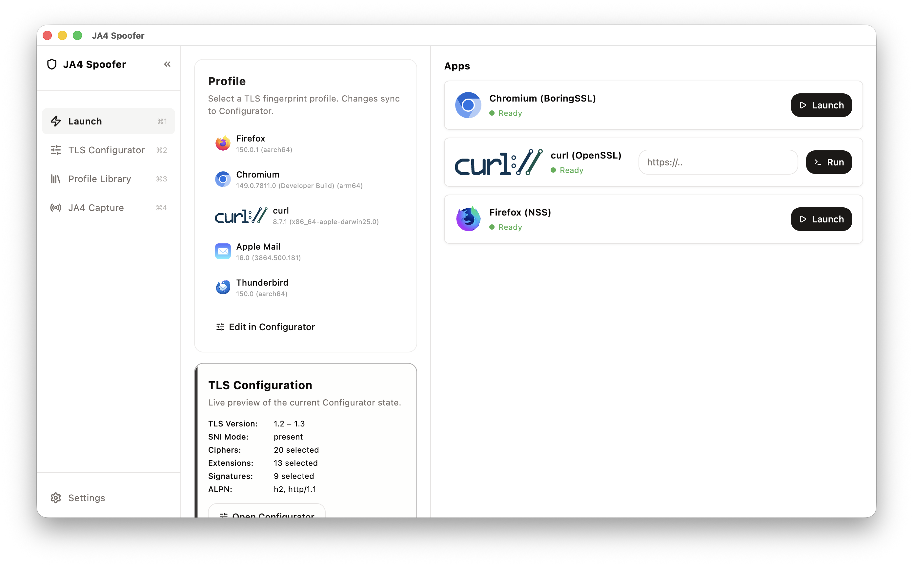
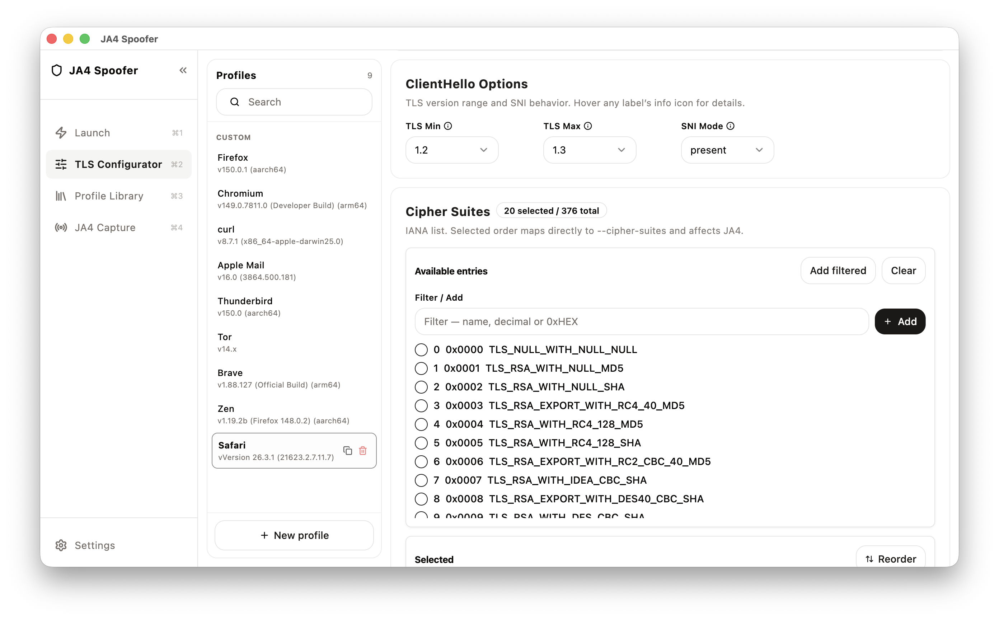
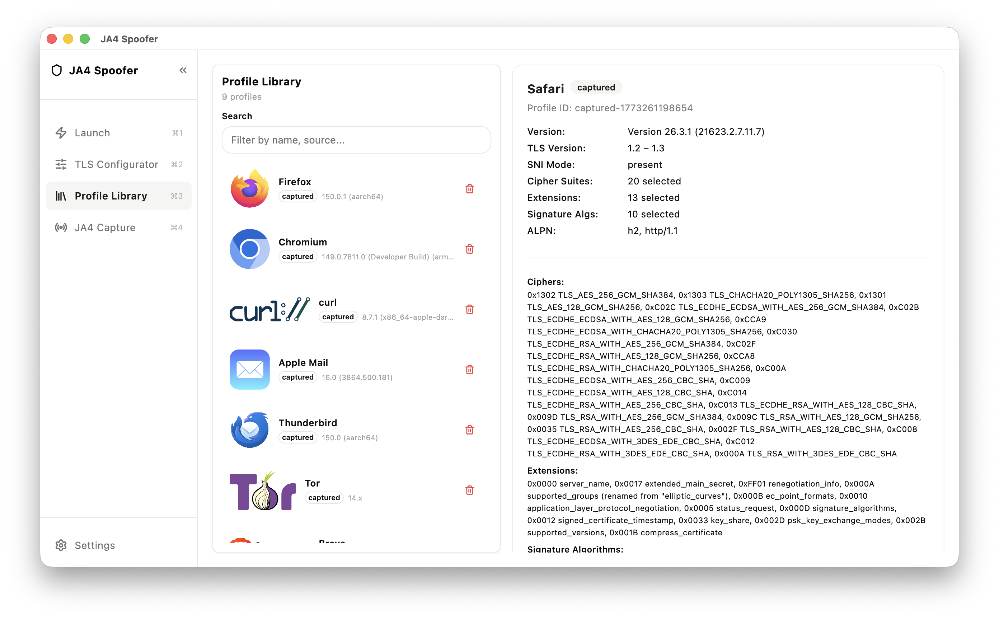
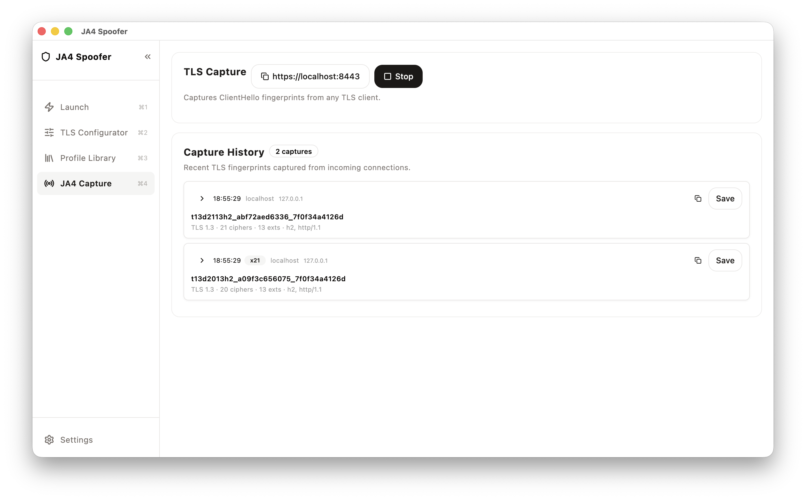

<p align="center">
  
</p>

# JA4 Spoofer

[](https://github.com/nurkert/ja4-spoofer/actions/workflows/release.yml)
[](https://github.com/nurkert/ja4-spoofer/releases)
[](LICENSE)

JA4 Spoofer is an open-source toolkit for controlled TLS ClientHello and JA4
fingerprint experiments. It patches common TLS stacks, builds client
applications against those patched stacks, and launches them with explicit
JA4-oriented profiles.

The project currently targets:

| Client | TLS stack | Status |
|---|---|---|
| Chromium | BoringSSL | Patched via `patches/boringssl/` |
| Firefox | NSS | Patched via `patches/nss/` |
| curl / OpenSSL CLI paths | OpenSSL | Patched via `patches/openssl/` |

## Features

- Patch workflows for BoringSSL, NSS and OpenSSL.
- A Flutter desktop GUI for profile editing, capture, randomization and launch.
- Scriptable CLI launchers for Firefox, Chromium and curl.
- A shared profile model for JA4-relevant ClientHello fields.
- Seed profiles and fixtures for repeatable verification.
- Diagnostic dumps that compare requested and effective wire values.

## Responsible Use

This project is intended for interoperability testing, measurement, client
fingerprinting research, and defensive analysis. Do not use it to bypass access
controls, impersonate users, evade abuse detection, or violate the terms of
services you do not control.

## Installation

Installable Linux releases are published as `.deb` files. After installation,
the GUI extracts its managed scripts, configs and patches to
`~/.ja4-spoofer/runtime/<version>/`; users do not need to point the app at a
repository checkout.

### Install from the APT repository (recommended)

```bash
   curl -fsSL https://apt.nurkert.de/install/ja4-spoofer | sudo sh
```

Upgrades arrive via `sudo apt upgrade` like any other package. Uninstall with
`sudo apt remove ja4-spoofer`.

### Install a pre-built `.deb`

Grab the latest `ja4-spoofer_*.deb` from the
[Releases page](https://github.com/nurkert/ja4-spoofer/releases) and install it:

```bash
sudo dpkg -i ja4-spoofer_*.deb
sudo apt-get install -f   # resolves any missing deps
```

### Build it yourself

```bash
git clone https://github.com/nurkert/ja4-spoofer
cd ja4-spoofer/tools/ja4-spoofer
flutter pub get
flutter build linux --release
```

The resulting binary file is at `build/linux/x64/release/bundle/ja4_spoofer`.
The filename uses an underscore because that is the Dart package name; the
APT package exposes it under the hyphenated `ja4-spoofer` command via a
launcher in `/usr/bin/`. For a manual build, mirror the same convention by
symlinking with the hyphenated name:

- **Option 1: Create a symbolic link**

  ```bash
  sudo ln -s "$(pwd)/build/linux/x64/release/bundle/ja4_spoofer" /usr/local/bin/ja4-spoofer
  ```

- **Option 2: Copy the binary into a directory in your `$PATH`**

  ```bash
  sudo cp build/linux/x64/release/bundle/ja4_spoofer /usr/local/bin/ja4-spoofer
  ```

Now you can launch the application simply by typing:

```bash
ja4-spoofer
```

### Create a Debian package

The repository ships with a helper script that synchronises the bundled
runtime assets (scripts, configs, patches), runs `flutter build linux`, and
packs everything into a `.deb` in a single command. Run it from the project
root and then install the resulting package with `dpkg`:

```bash
bash tools/ja4-spoofer/scripts/package_linux_deb.sh
sudo dpkg -i tools/ja4-spoofer/dist/ja4-spoofer_*_$(dpkg --print-architecture).deb
```

Pass `--no-build` to repackage without rebuilding, or `--no-sync` to skip the
asset sync step (e.g. when the CI has already done it).

After installation the `ja4-spoofer` command is available globally. To remove
the package again:

```bash
sudo apt remove ja4-spoofer
```

Build requirements: Flutter with Linux desktop enabled
(`flutter config --enable-linux-desktop`), plus
`clang lld llvm cmake ninja-build pkg-config libgtk-3-dev liblzma-dev dpkg-dev`.

### Run from source (development)

```bash
git clone https://github.com/nurkert/ja4-spoofer
cd ja4-spoofer/tools/ja4-spoofer
flutter pub get
flutter run -d linux    # or -d macos / -d windows
```

## Quickstart

In the GUI:

1. Select or create a JA4 profile.
2. Open **Launch**.
3. Click an app action. The first run clones or initializes the required
   upstream source on the host, checks out the pinned base ref, applies the
   patch stack, builds the target and launches it. Later runs launch directly
   while the patch stamp is still fresh.

**Launch** — Select a TLS profile and click an app to patch, build and launch it in one step. The button reads "Patch, Build & Launch" on the first run and shrinks to "Launch" once a fresh binary exists.

<p align="center">
  
</p>

**TLS Configurator** — Edit every JA4-relevant ClientHello field: TLS version range, cipher suites, extension order, ALPN, signature algorithms, named groups, GREASE and SNI behavior. Changes sync live to the active profile.

<p align="center">
  
</p>

**Profile Library** — Browse, search and manage saved fingerprint profiles. Ships with pre-captured seed profiles for Safari, Firefox, Chromium, Tor, Brave, Zen, Apple Mail and curl.

<p align="center">
  
</p>

**JA4 Capture** — Starts a local TLS proxy and records ClientHello fingerprints from any connecting client. Each capture can be saved as a profile and replayed exactly.

<p align="center">
  
</p>

Build times vary heavily. curl/OpenSSL is usually quick, Firefox can take around
an hour on a laptop, and Chromium can take several hours plus significant disk
space.

## Repository Layout

```text
configs/                 pinned build configuration
docs/                    technical documentation
libs/                    upstream TLS/client submodules
patches/                 JA4 patch sets applied to submodules
scripts/                 patch, build, launch and verification scripts
tests/                   JA4 fixtures and expected diagnostics
tools/ja4-spoofer/       Flutter desktop GUI
```

The `libs/` directories are upstream projects checked out as submodules. Local
JA4 changes are stored as patch files under `patches/`; the patched submodule
working trees are build artifacts, not the source of truth.

Packaged GUI builds do not bundle these upstream source trees. They bundle only
the project scripts, configs and patch files. On the user's machine, the build
flow clones the required upstream source fresh into the writable runtime area
and then applies the checked-in patch stack.

## Releases

Linux `.deb` releases are built by `.github/workflows/release.yml`.

- Run the workflow manually with a semantic version such as `1.2.3`.
- The workflow updates `tools/ja4-spoofer/pubspec.yaml`, commits the release
  version, creates tag `v1.2.3`, builds the Flutter Linux app and uploads the
  `.deb` to the GitHub release.
- Tag pushes `v*.*.*` also build a `.deb`, but the tag must match the pubspec
  version.

## Documentation

- [Documentation index](docs/README.md)
- [Managed libraries and patch workflow](docs/managed-libs.md)
- [Advanced launch options](docs/advanced-launch.md)
- [Fingerprint Config Standard](docs/fingerprint-config-standard.md)
- [JA4 capabilities and limits](docs/ja4-spoofing-summary.md)
- [Flutter GUI guide](tools/ja4-spoofer/README.md)

## Common Commands

```bash
# Apply all patch stacks to their pinned submodule refs.
scripts/apply_patches.sh

# Refresh patch files from local submodule commits.
scripts/refresh_patches.sh

# Run the verification harness against fixture profiles.
scripts/ja4_verify.sh

# Run Flutter tests.
cd tools/ja4-spoofer && flutter test
```

## License

The project-owned code, scripts, patches and documentation are released under
the **GNU General Public License v3.0 or later** (`GPL-3.0-or-later`). See
[LICENSE](LICENSE) for the full license text.

Third-party projects under `libs/` keep their own upstream licenses. This
repository license does not relicense OpenSSL, BoringSSL, NSS, Nginx, JA4 or
other external submodules.

<p align="center">
  
</p>
